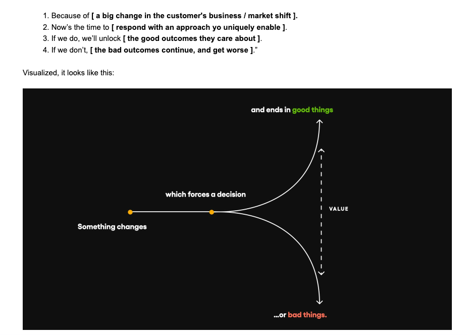

# teamfluence pro

# Skeleton

# Product Overview

The goal of the product revamp is to better adapt Teamfluence to the needs of agencies by giving them more control over how qualified leads are generated, how their clients’ LinkedIn profiles are managed, and making the product is white-label ready.

The product should also include analysis features to identify which content drives the best results, helping agencies refine and improve their content strategy.

### Positioning

1. Main focus on boutique content/ghostwriting agencies managing LinkedIn content for multiple retainer clients (their clients can be smaller companies).
2. 50+ employee B2B companies with a real internal marketing/sales/CS structure, running an agency-like content operation around their executives. 

Note: End-client will be using Teamfluence the same way as agencies. There is no difference how the product is set up. The marketing team can decide to create multiple account groups, like “Founder”, “Solution Specialists” or “HR” and split up accounts across these groups. 

### Why now?

1. *Because of [ AI taking over content production and making everyone a copy writer ].*
2. *Now’s the time to [ prove the value of strategic and tactical expertise and operational skills  ].*
3. *If we do, we’ll unlock [ deeply rooted client relationships ].*
4. *If we don’t, [ we get replaced with ChatGPT ].*

### Two working pages go with this overview:

- [**Product Story](Product%20Story%203bb6e2c95663803f94c4c9797ced437d.md)** — the brand narrative
- [**Product**](Product%203bb6e2c956638094adb6eb9fb3352750.md) — the full feature set and the gap analysis against the current Teamfluence product.

Temporary website idea:  [https://linkbeast.io](https://linkbeast.io)

[Product Story](Product%20Story%203bb6e2c95663803f94c4c9797ced437d.md)

[Product](Product%203bb6e2c956638094adb6eb9fb3352750.md)

[Development](Development%203ca6e2c95663804a919add848e7db8c5.md)

[Dictionary](Dictionary%203c36e2c9566380eca100f13ed45c2763.md)

[Risks](Risks%203bc6e2c9566380f6826ff91591be5b76.md)

[Work items](Work%20items%203c26e2c95663804cbaa1e9b84c11c982.md)

[Competitors](Competitors%203c26e2c956638019905bf221a7ee9a92.md)

[Pro - Marketing web site](Pro%20-%20Marketing%20web%20site%203cf6e2c9566380b78981e326e0760d7b.md)